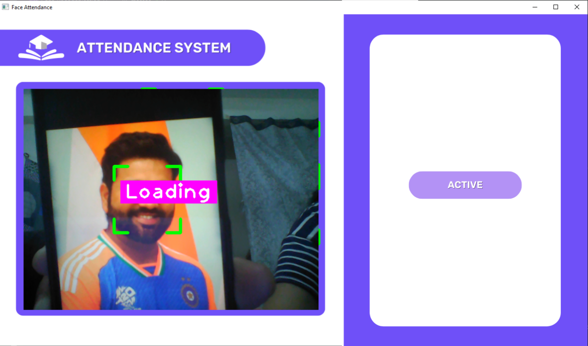
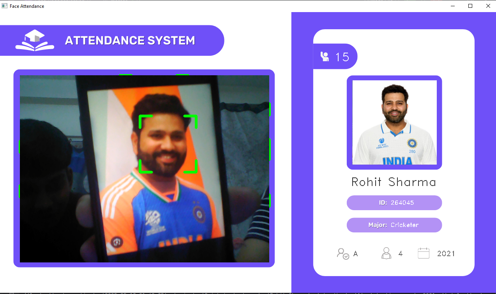
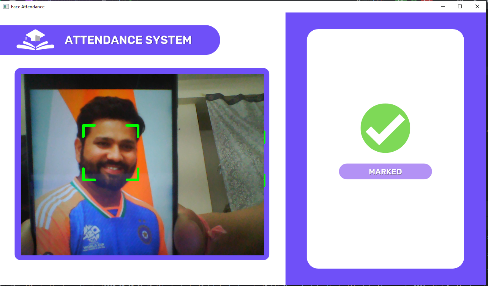
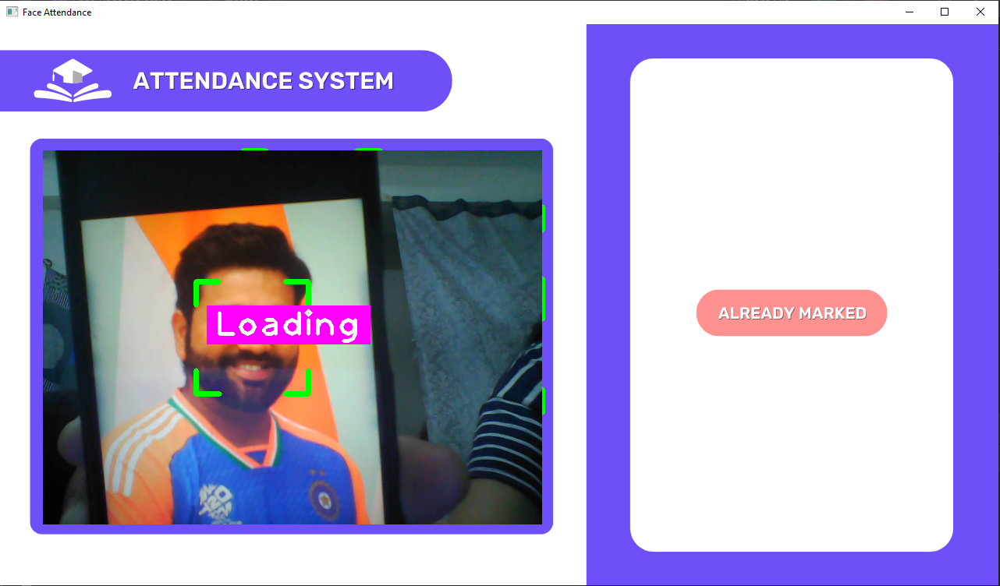

# 🧑‍💼 Face Recognition Attendance System

A real-time attendance system built with Python, OpenCV, and Firebase Realtime Database, that marks student attendance automatically using facial recognition.

## 🧰 Technologies Used

- Python 3
- OpenCV – For real-time webcam input and image handling
- face_recognition – For detecting and recognizing student faces
- Firebase Admin SDK – For syncing with Firebase Realtime Database and Storage
- cvzone – For drawing UI elements on the screen
- NumPy – For image and data array processing


## ✅ Key Benefits

- 🎯 High Accuracy: Prevents proxy attendance and manual marking errors.
- ⚡ Fast & Automatic: Detects and marks attendance instantly using a webcam.
- 👁️ Live Feedback: Students get immediate visual confirmation of their attendance.
- 📂 Smart Data Handling: Attendance is safely stored in Firebase and easy to manage.
- 🌐 Flexible Use: Works seamlessly in schools, colleges, or office setups.


## 📁 Project Structure

```plaintext
FaceRecognitionAttendance/
├── Images/                   # Student face images (named by ID)
├── Resources/
│   ├── background.png        # App UI background layout
│   └── Modes/                # UI screens (Loading, Marked, Already Marked, etc.)
├── EncodeGenrartor.py        # Generates encodings and uploads them to Firebase
├── main.py                   # Main app script for face recognition and attendance
├── EncodeFile.p              # Serialized (pickled) face encodings
└── serviceAccountKey.json    # Firebase credentials (keep private)
```
## ✨ Features

- 👤 Real-time face recognition using webcam for automatic attendance  
- 📡 Instant Firebase Realtime Database integration for storing attendance records  
- 🖼️ Graphical UI with visual feedback: "Active", "Marked", "Already Marked", "Loading"  
- 📋 Displays student details: Name, ID, Branch, Year, Major, etc.  
- 🧠 Uses pickle-based facial encoding for fast and efficient recognition  
- 🔄 Prevents duplicate entries with "Already Marked" alert  
- 🔐 Secure and scalable using Firebase Admin SDK credentials  

## 🖼️ UI Images

Below are the screenshots of the graphical user interface of the Face Recognition Attendance System:

### Active Mode
*System is ready for face recognition.*


### Student Details
*Displays student details like Name, ID, Branch, Year, Major.*


### Marked Mode
*Attendance has been recorded for the student.*


### Already Marked
*The student has already been marked as present.*



### 📦 Installation

To set up the Face Recognition Attendance System on your local machine, follow these steps:

---

#### 1. Clone the Repository

Start by cloning the repository to your local machine:

```bash
git clone https://github.com/harshitnagar22/Face_Attendance_System.git
cd Face_Attendance_System

```

---

#### 2. Install the Required Dependencies

Once the virtual environment is activated, install the required Python packages using the following command:

```bash
pip install -r requirements.txt
```

---

#### 3. Set Up Firebase Credentials

Download your **Firebase Admin SDK credentials** (`serviceAccountKey.json`) from your Firebase project and place it in the root directory of the project.

---

#### 4. Run the System

You're now ready to run the Face Recognition Attendance System:

```bash
python main.py
```

---


## 🚀 How to Run

1. Add student face images inside the `Images/` folder (e.g., 1001.png, 1002.png).
2. Generate encodings and upload data:
   python EncodeGenrartor.py
3. Start the face recognition system:
   python main.py

To use an external webcam, change this line in `main.py`:
   cap = cv2.VideoCapture(1)  # Use 1 or 2 based on your camera index

## 🙋‍♂️ Created by

Harshit Nagar  
🎓 BTech CSE @ JECRC University  
🔗 LinkedIn: https://www.linkedin.com/in/harshit-nagar-708a27290

## 🤝 Contributing

Contributions are welcome! If you have ideas to improve this project, feel free to fork the repo and submit a pull request.

### Steps to Contribute:

1. 🍴 Fork the repository
2. 🛠️ Create your feature branch (`git checkout -b feature/YourFeature`)
3. ✅ Commit your changes (`git commit -m 'Add some feature'`)
4. 🚀 Push to the branch (`git push origin feature/YourFeature`)
5. 📬 Open a Pull Request

### You can contribute by:
- Fixing bugs 🐞
- Improving performance ⚙️
- Enhancing UI 🎨
- Adding new features 💡
- Improving documentation 📝

> Make sure your code follows clean coding practices and includes comments where necessary.

## ✨ Use Cases

The **Face Recognition Attendance System** is ideal for various settings:

### 🎓 **Schools & Colleges**:
- Automates student attendance and prevents proxy attendance.

### 🏢 **Corporate Offices**:
- Tracks employee attendance and integrates with HR systems.

### 🎤 **Events & Conferences**:
- Quick and accurate attendance verification for event participants.

### 💻 **Online Classes**:
- Verifies real-time attendance in virtual classrooms.

---

## 🚀 Future Plans

The project is evolving with exciting future enhancements:

### 🌐 **System Integrations**:
- Integrate with **LMS** for automatic course attendance and **HR systems** for employee tracking.

### 📊 **Reporting & Alerts**:
- Real-time attendance alerts and detailed reports with visual data.

### 📱 **Mobile App**:
- A mobile app for easy attendance tracking on the go.

### 😃 **Advanced Features**:
- Add **facial expression recognition** to track engagement.

### 🏋️‍♂️ **Scalability**:
- Optimize for large-scale use in universities and big organizations.


## ⭐ Like the Project?

If you found this helpful, star the repo 🌟 and share it with others!


## 📝 License

This project is licensed under the MIT License.  
See the [LICENSE](LICENSE) file for details.


